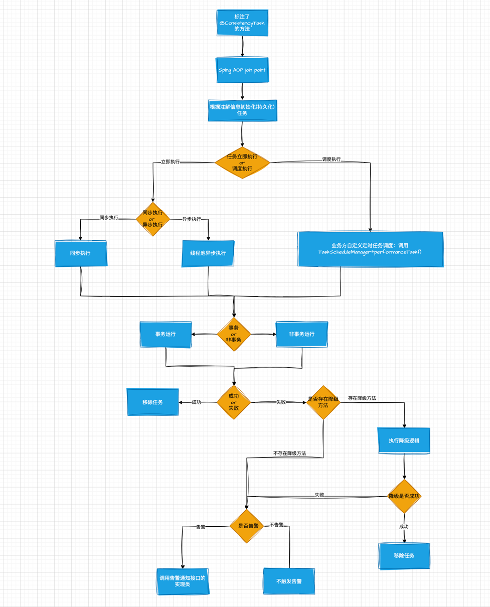

Argo 是一款基于Java实现的最终一致性组件，主要用于处理分布式系统中的数据一致性问题。
通过 SpringAOP ，将任务保存到数据库中，然后从数据库中读取任务来执⾏。
核心目的：代码中保证“某个操作(Action)”最终⼀定可以执⾏成功。
执行流程图：



### 快速集成
#### 1. 在 SpringBoot 工程中添加依赖（需要提前将 jar 包打入私服）
```xml
<dependency>
    <groupId>top.panson</groupId>
    <artifactId>argo-core</artifactId>
    <version>0.0.1-SNAPSHOT</version>
</dependency>
```

#### 2. mysql 中执行 sql

```mysql
CREATE TABLE `argo_task` (
        `id` bigint NOT NULL AUTO_INCREMENT COMMENT '主键⾃增',
        `task_id` varchar(500) CHARACTER SET utf8mb4 COLLATE utf8mb4_general_ci
                    NOT NULL COMMENT '⽤户⾃定义的任务名称，如果没有则使⽤⽅法签名',
        `task_status` int NOT NULL DEFAULT '0' COMMENT '执⾏状态',
        `execute_times` int NOT NULL COMMENT '执⾏次数',
        `execute_time` bigint NOT NULL COMMENT '执⾏时间',
        `parameter_types` varchar(255) CHARACTER SET utf8mb4 COLLATE
            utf8mb4_general_ci NOT NULL COMMENT '参数的类路径名称',
        `method_name` varchar(100) CHARACTER SET utf8mb4 COLLATE
            utf8mb4_general_ci NOT NULL COMMENT '⽅法名',
        `method_sign_name` varchar(200) CHARACTER SET utf8mb4 COLLATE
            utf8mb4_general_ci NOT NULL DEFAULT '' COMMENT '⽅法签名',
        `execute_interval_sec` int NOT NULL DEFAULT '60' COMMENT '执⾏间隔秒',
        `delay_time` int NOT NULL DEFAULT '60' COMMENT '延迟时间：单位秒',
        `task_parameter` varchar(200) CHARACTER SET utf8mb4 COLLATE
            utf8mb4_general_ci NOT NULL DEFAULT '' COMMENT '任务参数',
        `performance_way` int NOT NULL COMMENT '执⾏模式：1、⽴即执⾏ 2、调度执⾏',
        `thread_way` int NOT NULL COMMENT '线程模型 1、异步 2、同步',
        `error_msg` varchar(200) CHARACTER SET utf8mb4 COLLATE
            utf8mb4_general_ci NOT NULL DEFAULT '' COMMENT '执⾏的error信息',
        `alert_expression` varchar(100) CHARACTER SET utf8mb4 COLLATE
            utf8mb4_general_ci DEFAULT NULL COMMENT '告警表达式',
        `alert_action_bean_name` varchar(255) CHARACTER SET utf8mb4 COLLATE
            utf8mb4_general_ci DEFAULT NULL COMMENT '告警逻辑的的执⾏beanName',
        `fallback_class_name` varchar(255) CHARACTER SET utf8mb4 COLLATE
            utf8mb4_general_ci DEFAULT NULL COMMENT '降级逻辑的的类路径',
        `fallback_error_msg` varchar(200) CHARACTER SET utf8mb4 COLLATE
            utf8mb4_general_ci DEFAULT NULL COMMENT '降级失败时的错误信息',
        `shard_key` bigint DEFAULT '0' COMMENT '任务分⽚键',
        `gmt_create` datetime NOT NULL COMMENT '创建时间',
        `gmt_modified` datetime NOT NULL COMMENT '修改时间',
        PRIMARY KEY (`id`),
        UNIQUE KEY `uk_id_shard_key` (`id`,`shard_key`) USING BTREE
) ENGINE=InnoDB DEFAULT CHARSET=utf8mb4 COLLATE=utf8mb4_general_ci;
```

#### 3. 在application.properties中添加以下配置

```properties
spring:
  datasource:
    url: jdbc:mysql://localhost:3306/task-engine?characterEncoding=utf8&characterSetResults=utf8&autoReconnect=true&failOverReadOnly=false&useSSL=false
    username: root
    password: your password
    driver-class-name: com.mysql.cj.jdbc.Driver
    hikari:
      connection-timeout: 3000
top:
  panson:
    argo:
      parallel:
        pool:
          thread-max-pool-size: 6
          thread-core-pool-size: 6
          thread-pool-keep-alive-time: 60
          thread-pool-keep-alive-time-unit: SECONDS
          thread-pool-queue-size: 200
      action:
        fail-count-threshold: 0
      shard:
        task-sharded: false
```

#### 4. 在启动类中加上 `EnableTendConsistencyTask` 注解

```java
@EnableTendConsistencyTask
@EnableScheduling
@SpringBootApplication
public class Application {
    public static void main(String[] args) {
        SpringApplication.run(Application.class, args);
    }
} 
```

#### 5. 在目标方法上(必须是 public 方法)加上 `@ConsistencyTask` 注解
```java
@ConsistencyTask(
        id = "testAction",
        executeIntervalSec = 2,
        delayTime = 5,
        performanceWay = PerformanceEnum.EXECUTE_RIGHT_NOW,
        threadWay = ThreadWayEnum.ASYNC,
        fallbackClass = SendMessageFallbackHandler.class,
        alertActionBeanName = "normalAlerter"
)
public void action(CreateOrderRequest createOrderRequest) {
}
```

注解解释：
+ id: 表示action的名字
+ executeIntervalSec，默认20秒，表示失败间隔的基数，假如某个action已经失败了5次，那么第 5 次失败后需要等待（5+1） * executeIntervalSec 秒之后，才会进⾏第6次重试
+ delayTime: 当前action需要延迟多久执⾏，默认不延迟
+ performanceWay:当前的action是在当前线程执⾏，还是新创建线程执⾏。
+ fallbackClass： 降级类，执⾏失败会调⽤降级类的同名⽅法
+ alertActionBeanName：告警实例的beanName，需要实现ConsistencyFrameworkAlerter

#### 6. 自定义任务重试查询逻辑

任务失败重试是通过定时任务调⽤ `taskScheduleManager.performanceTask()` ⽅法来实现
的，底层逻辑就是根据条件从数据库中查询出来失败的任务，然后判
断是否需要重试，执行后续逻辑。

在这个过程中，根据条件查询失败的任务，这⾥的条件允许⼀定程度的⾃定义。默认情况下⾏为
是： **每次查询当前时间 - 1⼩时 时间范围内的1000条失败的记录**。

如果想要更改此逻辑，可以通过实现 `TaskTimeRangeQuery` 接⼝来达到⽬的。如下：

```java
@Component 
public class MyTaskTimeRangeQuery implements TaskTimeRangeQuery {
    /**
    * 获取查询任务的初始时间 默认的开始时间为 查询12⼩时内的任务
    *
    * @return 启始时间
    */
    @Override
    public Date getStartTime() {
        return DateUtils.getDateByDayNum(new Date(), Calendar.HOUR, -12);
    }
    /**
    * 获取查询任务的结束时间
    *
    * @return 结束时间
    */
    @Override
    public Date getEndTime() {
        return new Date();
    }
    /**
    * 每次最多查询出多少个未完成的任务出来
    *
    * @return 未完成的任务数量
    */
    @Override
    public Long limitTaskCount() {
        return 200L;
    }
}
```

同时在配置文件中增加配置：
```yml
top:
  panson:
    argo:
      parallel:
        pool:
          task-schedule-time-range-class-name: top.panson.argo.example.range.MyTaskTimeRangeQuery
```

